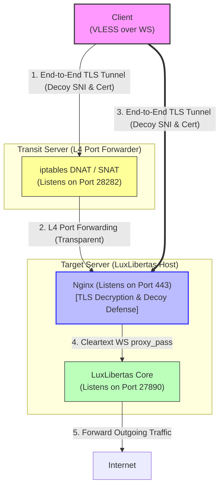

# What is LuxLibertas?

Light pierces the darkness, freedom flows through the wall. A lightweight, high-performance VLESS over Websocket transit core built with Go.

# Performance Benchmark

## 📊 Benchmark Environment Info

- **OS**: `darwin` (macOS)
- **Architecture**: `amd64`
- **CPU**: `Intel(R) Core(TM) i7-9750H CPU @ 2.60GHz`
- **Date**: June 9, 2026
- **Go Version**: `go version` (executed by system go environment)

---

## 📈 Benchmark Results

| Benchmark Name | Runs (Iterations) | Time (ns/op) | Memory (B/op) | Allocations (allocs/op) | Throughput (MB/s) |
| :--- | :---: | :---: | :---: | :---: | :---: |
| **VLESS Header Parsing** | | | | | |
| `BenchmarkParseVLESSHeader` | 4,803,958 | 247.0 ns/op | 576 B/op | 3 allocs/op | N/A |
| `BenchmarkParseVLESSHeader_Pure` | 12,149,959 | 110.5 ns/op | 16 B/op | 1 allocs/op | N/A |
| `BenchmarkParseVLESSHeader_IPv6` | 7,297,346 | 165.9 ns/op | 24 B/op | 1 allocs/op | N/A |
| `BenchmarkParseVLESSHeader_Domain` | 9,441,165 | 125.8 ns/op | 19 B/op | 2 allocs/op | N/A |
| `BenchmarkParseVLESSHeader_Mux` | 36,218,018 | 33.46 ns/op | 0 B/op | 0 allocs/op | N/A |
| `BenchmarkParseUUID` | 8,094,264 | 142.7 ns/op | 48 B/op | 2 allocs/op | N/A |
| **Connection & Relay Hot Paths** | | | | | |
| `BenchmarkWSConn_ReadHotPath` | 10,765,162 | 118.9 ns/op | 512 B/op | 1 allocs/op | N/A |
| `BenchmarkMuxServer_Relay` | 154,849 | 7,419.0 ns/op | 262 B/op | 3 allocs/op | 552.12 MB/s |
| `BenchmarkSlogLogging` | 6,248,131 | 186.6 ns/op | 0 B/op | 0 allocs/op | N/A |
| **Optimization Comparison (Old vs New)** | | | | | |
| `BenchmarkWSConnAllocation_Direct` | 49,302,873 | 24.73 ns/op | 32 B/op | 1 allocs/op | N/A |
| `BenchmarkWSConnAllocation_Pool` | 95,557,233 | 11.10 ns/op | 0 B/op | 0 allocs/op | N/A |
| `BenchmarkConnSetup_Old` | 6,813,486 | 161.6 ns/op | 640 B/op | 3 allocs/op | N/A |
| `BenchmarkConnSetup_New` | 38,127,796 | 28.64 ns/op | 0 B/op | 0 allocs/op | N/A |
| `BenchmarkMuxPool_PerServer` | 381,087 | 2,917.0 ns/op | 18,277 B/op | 4 allocs/op | N/A |
| `BenchmarkMuxPool_Global` | 100,000,000 | 12.01 ns/op | 0 B/op | 0 allocs/op | N/A |
| `BenchmarkSessionChan_Cap128` | 1,884,926 | 654.9 ns/op | 4,976 B/op | 2 allocs/op | N/A |
| `BenchmarkSessionChan_Cap32` | 5,471,156 | 225.9 ns/op | 1,264 B/op | 2 allocs/op | N/A |

---

# System Architecture

The traffic flow moves through a secure L4 port forwarding setup to the target application server where Nginx handles TLS decryption before proxying to the LuxLibertas service.

> ℹ️ **Purpose of Transit Server**: The primary role of the **Transit Server (NAT Server)** is to optimize routing and improve network quality, overcoming high latency or packet loss issues when the Client connects to the target server directly.

> ⚠️ **CRITICAL SECURITY NOTE**: Establishing a secure end-to-end TLS connection directly from the **Client to the Nginx server** (using a self-signed spoofed decoy SNI certificate) is the **absolute key to your security**. The LuxLibertas core itself does not handle encryption (encryption/decryption is entirely offloaded to Nginx/TLS). The intermediate NAT transit server simply forwards the L4 raw packets transparently and cannot see or decrypt the encrypted payload.



---

# NAT Port Forwarding Configuration

This guide explains how to set up high-performance and secure TCP port forwarding on a Debian/Ubuntu transit server using `iptables`.

### Prerequisites
Install the required packages first:
```bash
# Update repository and install iptables-persistent for saving rules
apt-get update -y
apt-get install -y iptables iptables-persistent
```

### Step 1: Enable IP Forwarding and Kernel Parameters
First, load the connection tracking module and configure system-level parameters for networking and TCP congestion control (BBR).

```bash
# Force load the connection tracking module
modprobe nf_conntrack

# Configure system parameters
cat <<EOF > /etc/sysctl.d/99-nat-forwarding.conf
# Enable IPv4 packet forwarding
net.ipv4.ip_forward = 1

# Enable BBR congestion control
net.core.default_qdisc = fq
net.ipv4.tcp_congestion_control = bbr

# Increase connection tracking limit and keepalive settings
net.netfilter.nf_conntrack_max = 1048576
net.ipv4.tcp_keepalive_time = 600
net.ipv4.tcp_keepalive_intvl = 30
net.ipv4.tcp_keepalive_probes = 5
EOF

# Apply the new sysctl parameters immediately
sysctl --system

# Set conntrack hash buckets to prevent latency and CPU spikes (4:1 ratio)
echo "options nf_conntrack hashsize=262144" > /etc/modprobe.d/nf_conntrack.conf
echo 262144 > /sys/module/nf_conntrack/parameters/hashsize
```

### Step 2: Configure Destination NAT (DNAT)
DNAT redirects incoming traffic on the transit server to the remote target IP and port. This must be applied to both external packets (`PREROUTING`) and local packets (`OUTPUT`).

```bash
# Define environment variables for clean configuration
LOCAL_IP="172.16.30.12"      # Transit server IP
LOCAL_PORT="28282"           # Port to listen on transit server
REMOTE_IP="1.2.3.4"          # Target remote IP
REMOTE_PORT="443"            # Target remote port

# Redirect incoming external traffic to the remote target
iptables -t nat -A PREROUTING -d "$LOCAL_IP" -p tcp --dport "$LOCAL_PORT" -j DNAT --to-destination "$REMOTE_IP:$REMOTE_PORT"

# Redirect locally initiated traffic on the transit server to the remote target
iptables -t nat -A OUTPUT -d "$LOCAL_IP" -p tcp --dport "$LOCAL_PORT" -j DNAT --to-destination "$REMOTE_IP:$REMOTE_PORT"
```

### Step 3: Configure Source NAT (SNAT)
SNAT rewrites the source IP of forwarded packets to the transit server's IP, ensuring that the target server sends response packets back through the transit server.

```bash
# Use static SNAT instead of MASQUERADE for better performance with a fixed IP
iptables -t nat -A POSTROUTING -p tcp -d "$REMOTE_IP" --dport "$REMOTE_PORT" -j SNAT --to-source "$LOCAL_IP"
```

### Step 4: Configure Security Rules (FORWARD Chain)
To secure the forwarding path, restrict traffic flow through the `FORWARD` chain by leveraging connection tracking states.

```bash
# Allow established and related packets to flow through instantly
iptables -A FORWARD -m conntrack --ctstate ESTABLISHED,RELATED -j ACCEPT

# Only allow new connection requests targeting the remote target destination
iptables -A FORWARD -p tcp -d "$REMOTE_IP" --dport "$REMOTE_PORT" -m conntrack --ctstate NEW -j ACCEPT
```

### Step 5: Persist Configuration
Save the rules to make sure they survive system reboots.

```bash
# Save active iptables rules permanently
iptables-save > /etc/iptables/rules.v4
```

---

# Nginx Configuration

Below is a production-grade, highly optimized Nginx configuration designed for single-core, low-memory (e.g., 512MB RAM) servers, featuring decoy site defense, rate-limiting, and TLSv1.3-only optimization.

```nginx
user  nginx;
# Lock strictly to a single worker process to eliminate multi-core context switching overhead on single-core hosts
worker_processes  1;

error_log /dev/null crit;
pid       /run/nginx.pid;

events {
    worker_connections  2048;
    use epoll;
    # Core optimization: disable multi_accept on single-core setups to prioritize already active streaming connections
    multi_accept off; 
}

http {
    include       /etc/nginx/mime.types;
    default_type  application/octet-stream;

    access_log    off; 
    tcp_nodelay   on;
    gzip          off;
    server_tokens off;

    keepalive_timeout  75;
    keepalive_requests 8192; # High keepalive requests to suit uninterrupted multi-hour streaming connections

    # Strict memory buffer controls
    client_max_body_size        2M;
    client_body_buffer_size     32k;
    client_header_buffer_size   1k;
    large_client_header_buffers 2 4k;      

    # Rate limiting: Allocate a 1MB zone (holds ~16,000 IP states) to restrict probing of the decoy homepage
    limit_req_zone $binary_remote_addr zone=decoy_limit:1m rate=3r/s;

    upstream luxlibertas {
        server        127.0.0.1:27890;
        keepalive     128; 
    }

    map $http_upgrade $connection_upgrade {
        default    upgrade;
        ''         close;
    }

    server {
        # Rely on default kernel backlog on single-core; add deep system-level TCP keepalives
        listen 443 ssl so_keepalive=3m:30s:3;
        server_name pay.weixin.qq.com;

        ssl_certificate /etc/nginx/ssl/nginx.crt;
        ssl_certificate_key /etc/nginx/ssl/nginx.key;

        # TLS Evolution: completely drop TLS 1.2, keep only pure and highly efficient TLS 1.3
        ssl_protocols TLSv1.3;
        
        # Cipher optimization: Prioritize CHACHA20 to rescue single-core CPUs lacking hardware AES acceleration
        ssl_ciphers ECDHE-ECDSA-CHACHA20-POLY1305:ECDHE-RSA-CHACHA20-POLY1305:ECDHE-ECDSA-AES128-GCM-SHA256:ECDHE-RSA-AES128-GCM-SHA256;
        ssl_ecdh_curve X25519:P-256; 

        # Memory balance: For 512MB RAM, a 3MB session cache (~12,000 sessions) is the sweet spot
        ssl_session_cache shared:SSL:3m; 
        ssl_session_timeout 3h;
        ssl_session_tickets off; 

        # ----------------------------------------------------
        # Decoy defense: Limit incoming probe requests to max 3 per second per IP to protect CPU from starvation
        # ----------------------------------------------------
        location / {
            limit_req zone=decoy_limit burst=5 nodelay;
            # Immediately close connection with 444 status on rate limit exceeded, saving resources
            limit_req_status 444; 

            proxy_pass https://pay.weixin.qq.com; 
            proxy_ssl_server_name on;
            proxy_set_header Host pay.weixin.qq.com;
            proxy_set_header Accept-Encoding "";
        }

        location /mxwiIYHl90hk8QCLwfzRY6UA_8CODNtQ2MA6ExYkfXwJuLQ_0CIKF7bMqx4skAygvqODfDFZrWloG_8jDiFH7w/ {
            proxy_http_version  1.1;
            proxy_buffering     off; # Absolute rule: disable buffering for streaming protocols
            
            proxy_set_header    Upgrade $http_upgrade;
            proxy_set_header    Connection $connection_upgrade;
            proxy_set_header    Host $http_host;
            proxy_set_header    X-Real-IP $remote_addr;
            proxy_set_header    X-Forwarded-For $proxy_add_x_forwarded_for;

            proxy_pass          http://luxlibertas;

            proxy_read_timeout  3600s;
            proxy_send_timeout  3600s;
        }
    }
}
```
